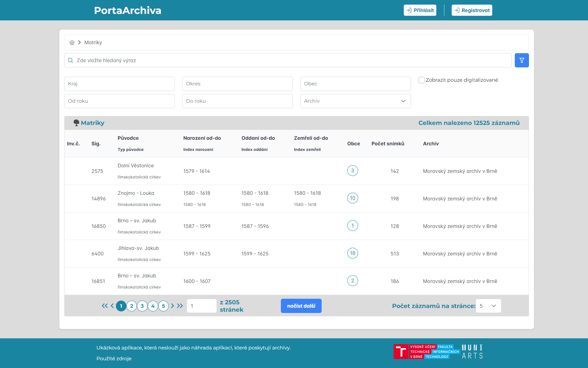

# Web for Displaying Archive Materials

This project is an output of my master thesis at the Faculty of Information Technology in Brno.

Supervisor: Ing. Jaroslav Rozman, Ph.D.

## Abstract
The aim of the thesis is to unify the data of the individual archives into one system, within which the user will be able to search and view the data. In particular, it is about scanned archival materials and their metadata. The thesis describes the different types of archival data and analyses the current systems. The thesis compares four scraping systems on the basis of dataset size, missing values and consistency between datasets. The archival imaging system is then modeled using behavioral and structural UML diagrams. The work also includes a graphical design produced in Figma. The thesis also includes a description of the implementation, testing and deployment procedure using Docker on the school infrastructure.

## Startup

To run the project, you must have docker installed and running on the hosted machine. Then there is a separate docker compose file for the backend and the client. To run successfully, .env files must be created for both the backend and the client. In the folder where the .env file needs to be created there is a reference .env.example.

To run the project itself without docker, an extensive set of tools is required as the project uses a wide variety of technologies.

The scraping system does not work on Windows due to dependencies. The backend requires Java to be installed and the frontend requires Node v20 and React compatible with this version. 

## Startup with Docker
### Prerequisities
-  Install docker
-  Install git
- If user isn't allowed to use docker:
  - Verify linux group `docker` exist via command `getent group docker`
  - If group doesn't exist, then create it via command `groupadd docker`
  - Associate user with group via command `usermod -aG docker <username>`
### Installation
- Clone this repository via command `git clone https://github.com/sestakp/Web-for-Displaying-Archive-Materials.git`
- Setup backend:
  - Create environment variable files from template via command `cp ./backend/.env.example ./backend/.env`
  - Update environment variables in `.env` file, **!!!change passwords!!!**, use random generators for generating strong passwords
  - Please note, default ports can be updated in `docker-compose.yml`
  - Build and start backend services in dettached mode via command `docker compose up -d`
  - Initialize scraping in dettached mode via command `docker exec -d archival_material_scraper sh ./run_spiders.sh`
- Setup client:
  - Create environment variable files from template via command `cp ./client/archival-material-client/.env.production.example ./client/archival-material-client/.env.production`
  - Update environment variables in `.env.production` file
  - Please note, default ports can be updated in `docker-compose.yml`
  - Build and start frontend application in dettached mode via command `docker compose up -d`

## Design
The system has been split into several separate services and synchronizes two separate databases. The individual system models are described in more detail in the text of the thesis.

## Result

## Home page

## List page

## Detail page

## Preview page

